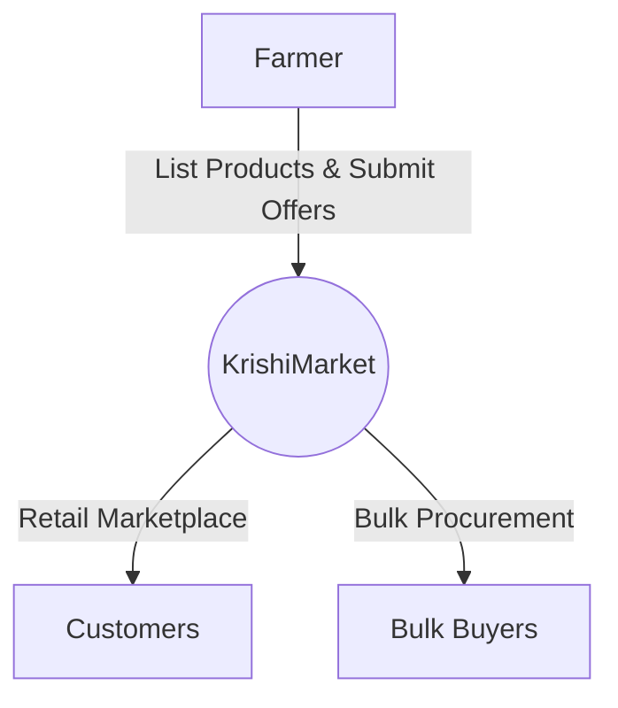
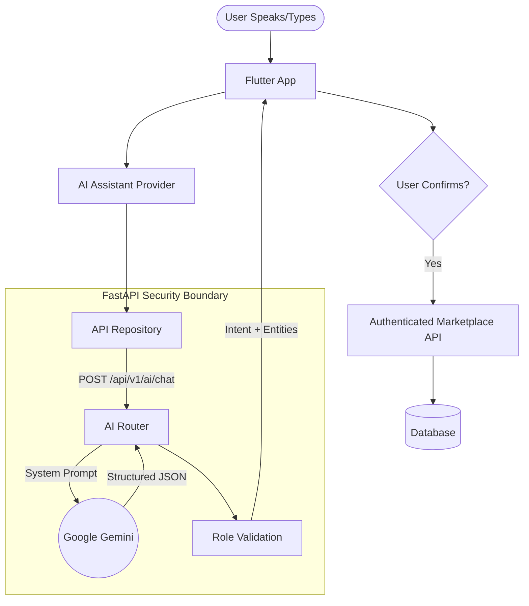
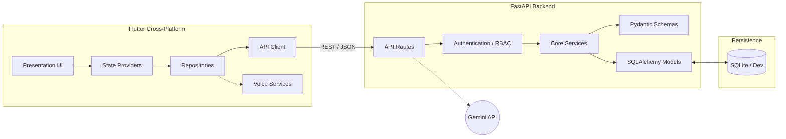

<div align="center">

# 🌾 KrishiMarket

**From Farm to Market — Without the Middleman.**

KrishiMarket is an AI-powered, multilingual digital marketplace designed to connect farmers directly with retail customers and bulk buyers. By breaking down language barriers and technical friction through Voice AI, the platform empowers rural farmers to manage digital storefronts, negotiate bulk procurements, and reach wider markets natively in 12 regional languages.


[Overview](#-the-problem) • [Features](#-key-features) • [AI](#-ai-architecture) • [Architecture](#️-system-architecture) • [Tech Stack](#️-technology-stack) • [Setup](#-getting-started) • [Testing](#-testing--quality) • [Roadmap](#-roadmap)

</div>

---

## 📸 Product Preview

> **Note to evaluators:** *Screenshots and demo GIFs showcasing the Farmer Dashboard, Multilingual UI, and AI Voice Assistant will be added to this section prior to final release.*

<details>
<summary><b>Expected Media Layout</b></summary>

| Farmer Marketplace | Customer Shopping | AI Voice Assistant |
| :---: | :---: | :---: |
| *(Placeholder)* | *(Placeholder)* | *(Placeholder)* |

</details>

---

## 🎯 The Problem

Agricultural commerce in many regions remains highly fragmented.

| Challenge | Why it matters | KrishiMarket Response |
|---|---|---|
| **Fragmented Market Access** | Farmers rely on local *mandis* and middlemen, severely reducing their profit margins. | Provides a direct digital storefront connecting farmers to local consumers and bulk buyers. |
| **Language Barriers** | Standard e-commerce apps require English proficiency, alienating rural users. | Deep ARB localization dynamically adapting the UI natively across 12 regional languages. |
| **Digital Literacy** | Complex UIs and manual typing requirements deter tech adoption. | Voice-driven AI translates natural spoken intent directly into structured digital actions. |
| **Bulk Procurement** | Large orders require scattered, offline negotiation and aggregation. | A dedicated requirement dashboard supporting reverse-offers and partial fulfillments. |
| **Order Management** | Farmers lack modern inventory and pricing tracking systems. | Simple, role-based dashboards for tracking listings, active orders, and market prices. |

---

## 💡 The Solution

**Technology should adapt to farmers, not force farmers to adapt to technology.**

KrishiMarket functions as a unified ecosystem. Farmers interact with a simplified, voice-enabled interface to list produce. Customers browse and purchase retail quantities locally. Bulk buyers submit large-scale requirements, and the system intelligently aggregates smaller farmer offers to fulfill massive orders.



---

## 👥 User Roles

KrishiMarket strictly separates application capabilities through Backend Role-Based Access Control (RBAC).

### 👨‍🌾 Farmer
- Create and manage product listings
- Manage active inventory and pricing
- Track and fulfill retail customer orders
- Participate in bulk buyer requirements
- Submit reverse-auction offers
- Utilize native Voice/AI interaction

### 🛒 Customer
- Browse the localized marketplace
- Search and filter specific agricultural products
- View detailed product specifications
- Manage shopping cart
- Execute secure checkout and track retail orders

### 🏢 Bulk Buyer
- Create massive bulk requirements (specify crop, target price, deadline, total quantity)
- Receive and review offers from multiple farmers
- Compare offers dynamically
- Accept offers to enable **partial fulfillment** aggregation

---

## ✨ Key Features

### 🌾 Marketplace
A dual-sided ecosystem where farmers maintain digital storefronts and customers execute seamless retail checkouts, completely localized.

### 🏢 Bulk Procurement (Partial Fulfillment)
A major differentiating feature. Bulk buyers can post massive requirements (e.g., *5000 kg of wheat*). Because individual farmers may not have 5000 kg, multiple farmers can submit smaller offers (e.g., *500 kg each*). The system aggregates these offers through **partial fulfillments** until the total target requirement is met.

### 🤖 AI Assistant
Integrated directly into the UX, the AI assistant translates natural language into structured platform actions. By identifying user intent and extracting entities, it dramatically reduces the friction of using a digital marketplace.

### 🎙️ Voice Interaction
Integrated device speech-to-text (`speech_to_text`) allowing hands-free, voice-driven interaction. Farmers can speak their requirements rather than navigating nested menus.

### 🌐 Multilingual UX
KrishiMarket provides a deeply native experience across **12 languages**. UI labels, category names, order statuses, and AI responses dynamically adjust to the selected language.

### 🔐 Authentication & Security
OTP-based authentication flow (currently mocked for development), backed by stateless JWT (Access & Refresh tokens). RBAC ensures that API authorization strictly matches user roles.

---

## 🧠 AI Architecture

This is a core technical innovation of KrishiMarket. Gemini does **not** run freely and does **not** directly mutate application state.



### 🔒 AI Security Model & Design Philosophy

**AI = Interpreter. Backend = Authority. User = Final Confirmation.**

1. **API Key Isolation:** The Gemini API key remains securely on the backend server; it is never embedded in the Flutter client.
2. **Untrusted Output:** The AI output is treated as untrusted. It only extracts an intent (`createProductListing`) and entities (`potato`, `50kg`).
3. **Backend Authorization:** RBAC ensures that even if the AI maps an intent, the backend will reject unauthorized requests (e.g., a Customer trying to create a product).
4. **User Confirmation:** Every AI-assisted action results in a pre-filled UI screen that the user must manually confirm before the database is mutated via normal application APIs.

---

## 🌐 Multilingual Architecture

KrishiMarket utilizes Flutter's ARB (Application Resource Bundle) localization to support 12 regional languages natively:

**English (en) • Hindi (hi) • Bengali (bn) • Gujarati (gu) • Kannada (kn) • Malayalam (ml) • Marathi (mr) • Odia (or) • Punjabi (pa) • Tamil (ta) • Telugu (te) • Assamese (as)**

```text
User Locale 
  ↓ 
Flutter ARB Files (app_hi.arb, etc.) 
  ↓ 
Generated Dart Safe Classes 
  ↓ 
Localized Flutter UI (Categories, Statuses, Labels)
```

The selected locale is also passed to the FastAPI AI endpoint to ensure the Gemini response is returned in the appropriate language.

---

## 🔄 How It Works

### Farmer Listing Workflow


### Customer Purchase Workflow


### Bulk Procurement Workflow


---

## 🏗️ System Architecture



---

## 🧩 Flutter Architecture

The mobile application utilizes a **feature-first** architecture to ensure separation of concerns, scalability, and testability.

```text
lib/
├── core/              # Global routing, networking, theming, and error handling
├── features/          
│   ├── ai_assistant/  # AI chat interface, intent handling, and voice processing
│   ├── auth/          # OTP forms and JWT token management
│   ├── marketplace/   # Product browsing, cart, retail orders, and bulk workflows
│   └── settings/      # User preferences and localization toggles
└── l10n/              # Application Resource Bundles (ARB) for 12 languages
```

---

## 🔌 Backend Architecture & API Overview

The Python FastAPI backend is strictly separated into domains under `backend/app/`:

| Domain | Endpoint Group | Purpose | Access |
|---|---|---|---|
| **Auth** | `/api/v1/auth/*` | OTP requests, verification, JWT refresh, logout | Public / Authenticated |
| **Products** | `/api/v1/products` | Create, read, update, delete farmer listings | Authenticated (Farmers write) |
| **Orders** | `/api/v1/orders` | Checkout retail orders, view order history | Authenticated |
| **Bulk** | `/api/v1/bulk` | Requirements creation, farmer offers, partial fulfillment | Authenticated (Strict RBAC) |
| **AI** | `/api/v1/ai/chat` | Proxy to Gemini for natural language intent extraction | Authenticated |

---

## 🗄️ Database

- **Technology:** SQLite (Currently used for rapid development; PostgreSQL planned for production).
- **ORM:** SQLAlchemy (Async).
- **Migrations:** Alembic.
- **Major Entities:** Users, Products, Orders, OrderItems, BulkRequirements, BulkOffers.

---

## 🛠️ Technology Stack

| Layer | Technology | Purpose |
|---|---|---|
| **Frontend** | Flutter / Dart | Cross-platform application UI |
| **State Management** | Provider | Reactive application state handling |
| **Voice Interaction** | `speech_to_text` | Device-native voice recognition |
| **Localization** | Flutter ARB | Generated multilingual UI framework |
| **Security** | `flutter_secure_storage` | Encrypted JWT token storage |
| **Backend API** | FastAPI / Python | High-performance async REST API |
| **Validation** | Pydantic | Strict data validation and serialization |
| **ORM & DB** | SQLAlchemy / SQLite | Async database access and relational persistence |
| **Migrations** | Alembic | Schema version control |
| **AI Processing** | Google Gemini | Natural language intent & entity extraction |

---

## 📂 Project Structure

```text
KrishiMarket/
├── android/               # Native Android configuration
├── ios/                   # Native iOS configuration
├── web/                   # Web compilation targets
├── linux/                 # Native Linux configuration
├── macos/                 # Native macOS configuration
├── windows/               # Native Windows configuration
├── assets/                # Static images and icons
├── lib/                   # Flutter Application Source (Feature-first)
├── backend/               # FastAPI Backend Source
│   ├── app/               # API routes, models, schemas, and services
│   ├── alembic/           # Database migration revisions
│   ├── scripts/           # Python mock data & verification scripts
│   └── tests/             # Backend pytest suite
├── scripts/               # Root generation and migration utilities
├── test/                  # Flutter unit and widget tests
├── docs/                  # Project audit reports and documentation
├── pubspec.yaml           # Flutter dependencies
├── l10n.yaml              # Localization configuration
├── .gitignore             # Version control exclusions
└── README.md              # Project documentation
```

---

## 🧪 Testing & Quality

KrishiMarket relies on rigorous testing to maintain quality across its layers.

**Flutter Tests:**
Currently, **57 out of 57 Flutter tests are passing**. These tests cover Providers, navigation, API mocking, and widget interactions.
```bash
flutter analyze
flutter test
```
*(Note: `flutter analyze` currently reports 0 errors, though a few minor pre-existing deprecation/info warnings remain regarding unused imports and `print` statements).*

**Backend Tests:**
The backend utilizes `pytest` for API testing.
```bash
cd backend
# Note: Ensure PYTHONPATH is correctly set to include the backend root
pytest
```

---

## 🚀 Getting Started

### Prerequisites
- Flutter SDK (^3.13.1)
- Dart
- Python 3.10+
- Git

### 1. Clone the Repository
```bash
git clone https://github.com/CodebyShafat/KrishiMarket-AgriTech.git
cd KrishiMarket
```

### 2. Backend Setup
```bash
cd backend
python -m venv venv

# Activate (Windows)
.\venv\Scripts\activate

# Activate (macOS/Linux)
source venv/bin/activate

# Install dependencies
pip install -r requirements.txt
```

**Environment Variables:**
Copy the template environment file:
```bash
cp .env.example .env
```
Ensure your `.env` contains:
```ini
DATABASE_URL=sqlite+aiosqlite:///./temp.db
JWT_SECRET=change-this-development-secret
GEMINI_API_KEY=your_gemini_api_key_here
ENVIRONMENT=development
```
*(⚠️ **WARNING**: Never commit your `.env` file or expose actual API keys to version control.)*

**Run FastAPI:**
```bash
python -m uvicorn app.main:app --host 127.0.0.1 --port 8000
```

### 3. Flutter Setup
Open a second terminal at the project root:
```bash
flutter pub get
flutter gen-l10n

# Run on available device (Chrome, Windows, Android Emulator, etc.)
flutter run
```

---

## 📦 Build APK (Android)

To generate a release APK for Android deployment:
```bash
flutter build apk --release
```
The resulting APK will be located at: `build/app/outputs/flutter-apk/app-release.apk`.

---

## 🔑 Development Authentication

> ⚠️ **DEVELOPMENT ONLY**  
> Real SMS OTP gateways are deliberately bypassed in the local development environment.  
> To authenticate during local testing, enter any valid phone number format (e.g., `+919999123456`) and use the mocked universal OTP:  
> **`123456`**

---

## 🗺️ Roadmap

✅ **Implemented**
- Core farmer and retail customer marketplace
- JWT and OTP authentication architecture
- 12-language ARB localization integration
- Bulk requirement and partial fulfillment engine
- Secure Gemini AI proxy boundary
- Speech-to-text processing

🚧 **In Progress**
- Polishing UI/UX state transitions
- Expanding edge-case test coverage

🔜 **Planned**
- Real SMS OTP gateway integration
- Digital payment gateway integration
- Logistics tracking modules
- PostgreSQL migration for production scaling

---

## 🌟 Engineering Highlights

- 🔐 **Backend-controlled AI actions:** AI is constrained to intent extraction; business logic is protected.
- 🌐 **12-language localization:** Native UI strings dynamically swap based on the selected region.
- 🏢 **Partial bulk fulfillment:** Resolves massive corporate requirements through micro-farmer aggregation.
- 🧩 **Feature-first Flutter architecture:** Highly modular frontend separating UI, state, and routing.
- ⚡ **FastAPI backend:** Leverages async Python for highly concurrent API performance.

---

## 📊 Project Status

| Component | Status |
|------|--------|
| Flutter App | Implemented |
| FastAPI Backend | Implemented |
| Authentication | Implemented (Dev OTP) |
| Retail Marketplace | Implemented |
| Bulk Procurement | Implemented |
| AI Integration | Implemented |
| Voice Services | Implemented |
| Localization | Implemented (12 languages) |
| Testing | Automated Tests Implemented |

---

## 🤝 Contributing

Contributions are welcome!
1. Fork the repository
2. Clone your fork
3. Create a feature branch (`git checkout -b feature/amazing-feature`)
4. Develop and verify against existing tests (`flutter test` / `pytest`)
5. Open a Pull Request

---

## 📜 License

*License: Not specified yet.*

---

## 👨‍💻 Author

**Shafat Ansari**  
GitHub: [CodebyShafat](https://github.com/CodebyShafat)  
Repository: [https://github.com/CodebyShafat/KrishiMarket-AgriTech](https://github.com/CodebyShafat/KrishiMarket-AgriTech)